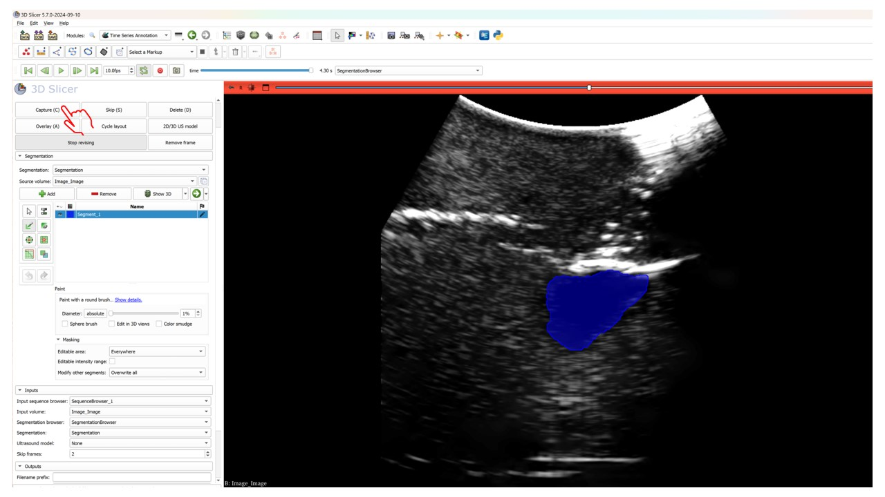

# Time Series Annotation Module for 3D Slicer

This repository contains the `Time Series Annotation` module for 3D Slicer, designed to assist with the segmentation and annotation of time-series data, such as ultrasound sequences.

## Table of Contents
- [Overview](#overview)
- [Getting Started](#getting-started)
  - [Prerequisites](#prerequisites)
  - [Installation](#installation)
- [Usage](#usage)
  - [Preparing the Environment](#preparing-the-environment)
  - [Understanding the Interface](#understanding-the-interface)
  - [Annotating Time Series Data](#annotating-time-series-data)

## Overview

The `Time Series Annotation` module in 3D Slicer provides tools for annotating and segmenting time-series data. This is particularly useful for medical imaging data such as ultrasound sequences.

## Getting Started

### Prerequisites

- 3D Slicer (version 4.11 or later) installed on your machine.
- Data prepared in the form of ultrasound sequences or other time-series volumes.

## Usage
### Preparing the Environment

1. **Load Your Data**: Start by loading your time-series data (e.g., ultrasound sequences) into 3D Slicer. Ensure that your dataset is correctly formatted and imported before proceeding to node setup.

2. **Node Setup**: 

   - **Prepare All Nodes in Advance**: Before using the module, you must prepare the necessary nodes. Specifically, you need to create and configure both the `Segmentation` node and the `SegmentationBrowser` node.
   
   - **Segmentation Node**: The segmentation node will be used to store your annotations. Ensure this node is correctly set up with your target structures.

   - **SegmentationBrowser Node**: The `SegmentationBrowser` node should be configured to include both the `Segmentation` node and the source volume as proxy nodes. This configuration is crucial, as the segmentation browser must manage and synchronize these nodes during the annotation process.

   - **Transformation Alignment**: Finally, make sure that the segmentation and source volume nodes are under the same transformation. This alignment is essential to maintain consistency across the entire annotation process, ensuring that the segmentations accurately correspond to the source volume.

### Segmentation Section

- **Segmentation**: Begin by selecting the segmentation node that you intend to annotate. This node will store all the annotations created during the session, so ensure it is correctly initialized and contains the relevant structures.

- **Source Volume**: Next, choose the source volume associated with your segmentation. This volume is the reference dataset that your segmentation will align with, ensuring accurate and meaningful annotations.

### Inputs Section

- **Input Sequence Browser**: Select the sequence browser node that contains your time-series data. This node should be configured to handle the sequential frames of your dataset, enabling efficient navigation and annotation.

- **Input Volume**: Specify the volume node associated with your input sequence. This node represents the underlying data that you’ll be annotating, and it must be synchronized with your segmentation.

- **Segmentation Browser**: Choose the `SegmentationBrowser` node that manages your segmentation and source volume. This node is critical for maintaining synchronization between the segmentation and volume during the annotation process.

- **Segmentation**: The segmentation node should already be set based on your earlier selection in the Segmentation Section. Ensure it is correctly linked to the `SegmentationBrowser` to maintain alignment.

- **Ultrasound Model**: If applicable, select the ultrasound model node that provides a 3D representation of the ultrasound data. This is particularly useful for visualizing complex anatomical structures during annotation.

- **Skip Frames**: Define the number of frames to skip during the annotation process. The default value is set to 4, but you can adjust this based on the density of frames in your dataset and the granularity of annotations required.

### Outputs Section

- **Filename Prefix**: Set a specific prefix for your output files. This prefix will be prepended to all filenames, helping you organize and identify the outputs associated with this session.

- **Output Folder**: Designate the folder where all annotated sequences and volumes will be saved. Ensure the path is correctly set to avoid data loss and to keep your project files organized.

- **Export Sequence to Files**: Use this button to export your annotated sequences into a series of files. This allows for further analysis or integration with other datasets or software.

- **Reconstruct Segmentations to Volume**: Click this option to reconstruct your segmentations into a single volume. This is useful for visualizing the cumulative effect of your annotations and performing additional volume-based analyses.

- **Delete All Recorded Segmentations**: If necessary, clear all recorded segmentations with this button. This action cannot be undone, so ensure that you have saved any important data before proceeding.

- **Load Sample Data**: Use this option to load sample data and practice with the module. This is a great way to familiarize yourself with the module’s functionality before applying it to your own data.

### Annotating Time Series Data

Once your environment is fully prepared, you can begin annotating your time-series data using the intuitive buttons in the GUI:

- **Capture (C)**: Captures the current frame and adds it to your segmentation sequence. This is the primary action for building your annotation dataset, allowing you to save significant frames as you progress through the sequence.

- **Skip (S)**: Skips to the next frame based on the interval set in the "Skip Frames" input. This functionality is particularly useful when working with dense datasets, enabling you to focus on key frames without manually advancing each one.

- **Delete (D)**: Removes the currently captured frame from the segmentation sequence. Use this when a captured frame no longer fits the criteria for inclusion, or if it was added in error.

- **Overlay (A)**: Toggles the overlay mode, allowing you to visualize your segmentation directly on top of the source volume. This feature is essential for verifying that your annotations align correctly with the underlying data.

- **Cycle Layout**: Adjusts the layout of the viewer to suit your workflow preferences. Different layouts can offer better perspectives or highlight specific aspects of the data, enhancing your annotation accuracy.

- **2D/3D US Model**: Switches between 2D and 3D ultrasound model views. Depending on the complexity of the anatomy you're working with, switching between these modes can provide more detailed insights and improve your annotation precision.

- **Revise Segmentations**: Use this button to revisit and adjust your segmentations as needed. This feature is crucial for refining your work, ensuring that all annotations meet the required standards before finalizing the dataset.

